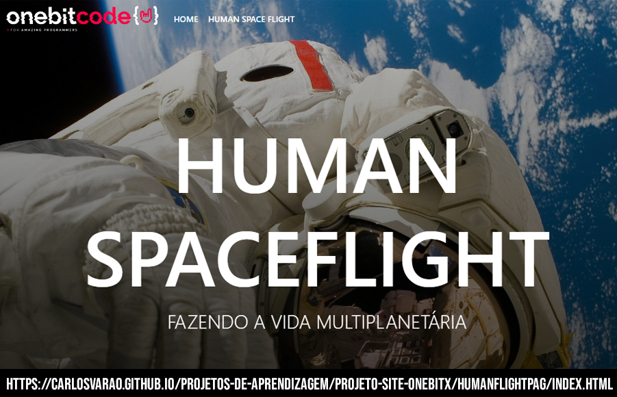

# Apresentação dos sites :

 
 

  &ensp;
  &ensp;
  &ensp;
  <a href="https://carlosvarao.github.io/Projetos-de-aprendizagem/Projeto-relogio/index.html" target="_blank">CLICK - HERE</a>
 

 
 
  
 

 

#

 
 

  &ensp;
  &ensp;
  &ensp;
  <a href="https://carlosvarao.github.io/Projetos-de-aprendizagem/Projeto-validador-de-idade/index.html" target="_blank">CLICK - HERE</a>
 

 
 
  
 

 

#

 

  &ensp;
  &ensp;
  &ensp;
  &ensp;
  <a href="https://carlosvarao.github.io/Projetos-de-aprendizagem/Projeto-formulario-oneBit/index.html" target="_blank">CLICK - HERE</a>
 

 
 
  
 

#

 

  &ensp;
  &ensp;
  &ensp;
  &ensp;
  <a href="https://carlosvarao.github.io/Projetos-de-aprendizagem/Projeto-site-onebitX/homePag/index.html" target="_blank">CLICK - HERE</a>
 

 
 
  
 

#

#

 

  &ensp;
  &ensp;
  &ensp;
  &ensp;
  <a href="https://carlosvarao.github.io/Projetos-de-aprendizagem/Projeto-site-onebitX/falcon9Pag/index.html" target="_blank">CLICK - HERE</a>
 

 
 
  
 

#

 

  &ensp;
  &ensp;
  &ensp;
  &ensp;
  <a href="https://carlosvarao.github.io/Projetos-de-aprendizagem/Projeto-site-onebitX/humanFlightPag/index.html" target="_blank">CLICK - HERE</a>
 

 
 
  
 

